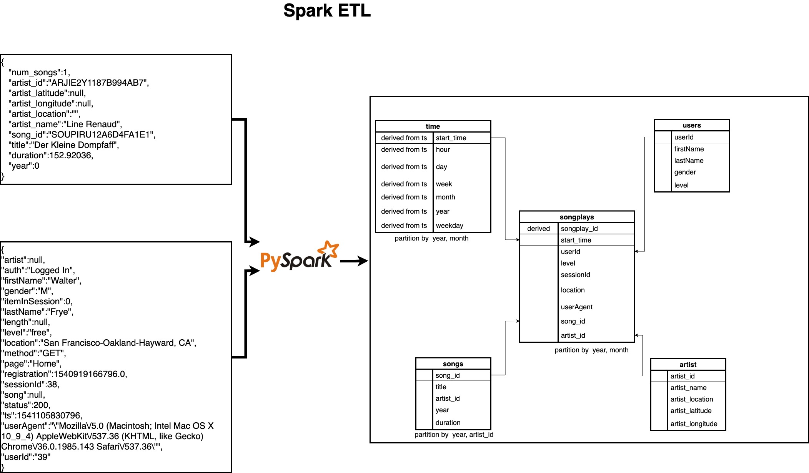

# Project Description

A music streaming startup, Sparkify, has grown their user base and song database even more.
The user activity logs and the songs metadata used in the app are in json format and is stored in the S3 bucket 
Sparkify wants to move their data warehouse to a data lake and allow their analytics team to continue finding the insights in what songs their users are listening to.  

## Solution
ETL pipeline will be built to extract the data in the from S3 and process the data usng Spark cluster in aws, and load the data back as parquet files, optimised for read, into S3 bucket as set of dimensional tables 

#### Analysing the data source 

##### Song dataset 
##### (Source : s3://udacity-dend/song_data)

Each file is in JSON format and contains metadata about a song and the artist of that song. The files are partitioned by the first three letters of each song's track ID. For example, here are filepaths to two files in this dataset.
* song_data/A/B/C/TRABCEI128F424C983.json
* song_data/A/A/B/TRAABJL12903CDCF1A.json
And below is an example of what a single song file, TRAABJL12903CDCF1A.json, looks like.

<code>
{
   "num_songs":1,
   "artist_id":"ARJIE2Y1187B994AB7",
   "artist_latitude":null,
   "artist_longitude":null,
   "artist_location":"",
   "artist_name":"Line Renaud",
   "song_id":"SOUPIRU12A6D4FA1E1",
   "title":"Der Kleine Dompfaff",
   "duration":152.92036,
   "year":0
}
</code>

##### Analysing the log data 
##### (Source : s3://udacity-dend/log_data)

<code>
{
   "artist":null,
   "auth":"Logged In",
   "firstName":"Walter",
   "gender":"M",
   "itemInSession":0,
   "lastName":"Frye",
   "length":null,
   "level":"free",
   "location":"San Francisco-Oakland-Hayward, CA",
   "method":"GET",
   "page":"Home",
   "registration":1540919166796.0,
   "sessionId":38,
   "song":null,
   "status":200,
   "ts":1541105830796,
   "userAgent":"\"Mozilla\/5.0 (Macintosh; Intel Mac OS X 10_9_4) AppleWebKit\/537.36 (KHTML, like Gecko) Chrome\/36.0.1985.143 Safari\/537.36\"",
   "userId":"39"
}
</code>

## ETL - Dataflow

# Implementation

config parser is used to store all the credentials.

**[etl.py](etl.py)** is where you'll load data from S3 into spark and then process that data, convert the data into parquet before copying into S3 bucket